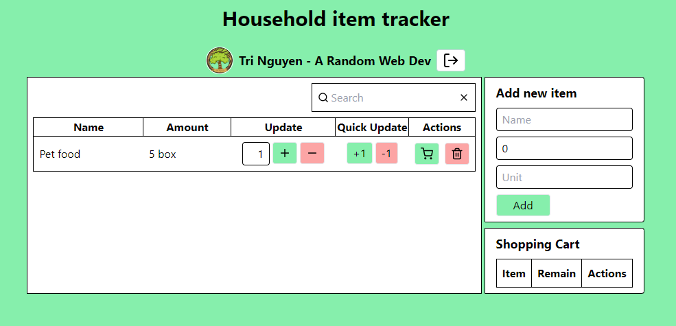
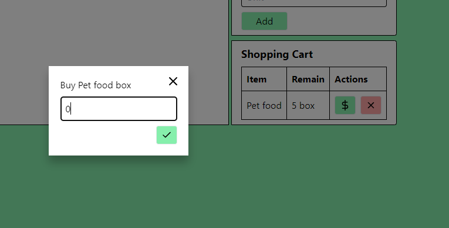

# Household Inventory Manager

-   Deployed app: https://mankinchi.github.io/house-inventory-manager/
-   Repo: https://github.com/mankinchi/house-inventory-manager

## Issues

Have you ever wonder how many items do you have in the house? Or when you are shopping, do you need to buy more supply of something? Don't worry, this will help you out 😉

## Features

-   Personal usage with protection 😊
-   Keep track of household items in the house
-   Button to quickly update item's quantity
-   System to add items into shopping cart and buy item
-   Ability to sync between devices with nearly zero latency 😉 (for any couples that wanna do shopping at the same time but different places)

## To run locally

-   Run `npm i`
-   Run `npm run dev`
